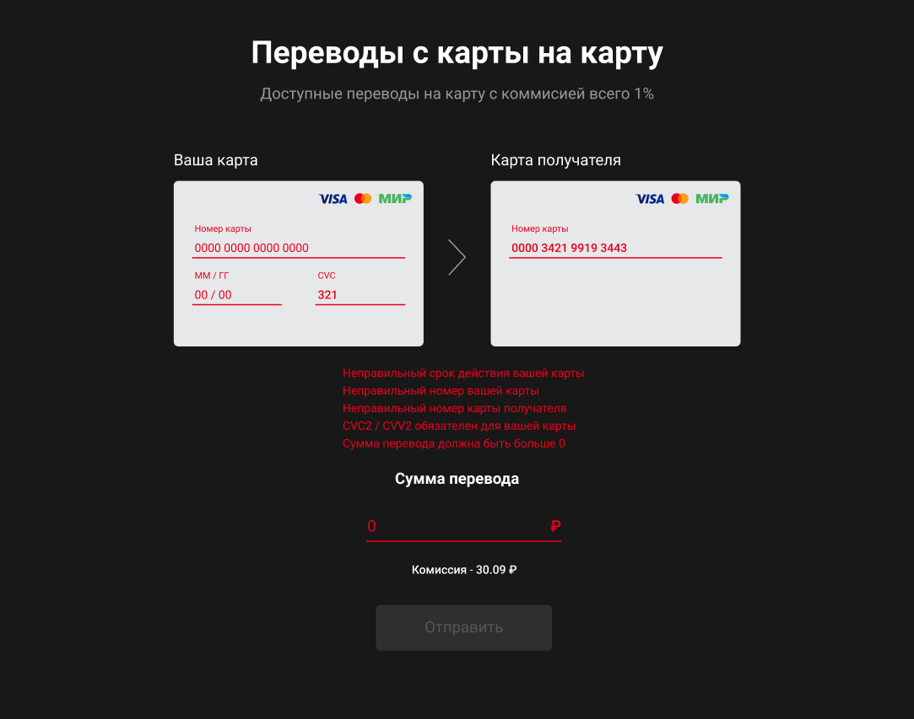
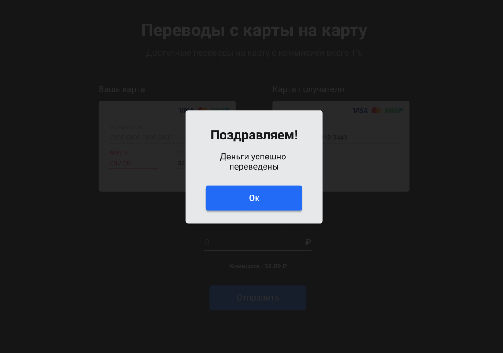

# Переводы с карты на карту

Приложение предоставляет простой интерфейс перевода денег с карты на карту.


## Запуск
Для запуска приложения необходимо склонировать репозиторий, открыть корневую директорию проекта и выполнить команду `npm i`. После установки всех зависимостей, нужно поменять значение переменной `REACT_APP_API_URL` в файле `.env` URL нашего API на свой. Описывать эндпоинты в файле `.env` **НЕ НУЖНО**.

Для запуска приложения необходимо использовать ```Dockerfile```. Проект будет доступен по ссылке `http://localhost:3000/`.


## Описание
Проект предоставляет UI для перевода денег с карты на карту. В видимой части приложения присутствуют две карты (откуда и куда переводить), поле ввода суммы перевода и кнопка "отправить".

На форму наложены ограничения и форматирования ввода, можно ввести только числа.

Форматирование на полях:
Номер карты `0000000000000000` → `0000 0000 0000 0000`,
ММ/ГГ `1234` → `12/34`,
Сумма перевода `12345678` → `₽ 12 345 678`.

Валидации на полях:
`Номер карты` - обязательное, минимум 16 знаков,
`ММ/ГГ` - обязательное, минимум 4 знака, дата не может быть ниже текущей, месяц не может быть ниже 1 и выше 12,
`CVC` - обязательное, минимум 3 знака,
`Сумма перевода` - обязательное, не может быть равное или меньше 0.

Проверка ошибок срабатывает во время нажатия кнопки "Отправить".



## Запросы
Запросы формируются самим приложением на URL состоящий из заданного значения переменной `REACT_APP_API_URL` и "хвостов" эндпоинта.

Эндпоинты:
`/transfer` - принимает объект с данными формы,
`/confirmOperation` - принимает объект с айди операции и секретным кодом.

При возникновении ошибки на стороне сервера, будет отображено модальное окно с текстом ошибки, которую сервер прислал в поле `message` ответа.


При успешной отправке, отображается соответствующее модальное окно и поля формы очищаются.

